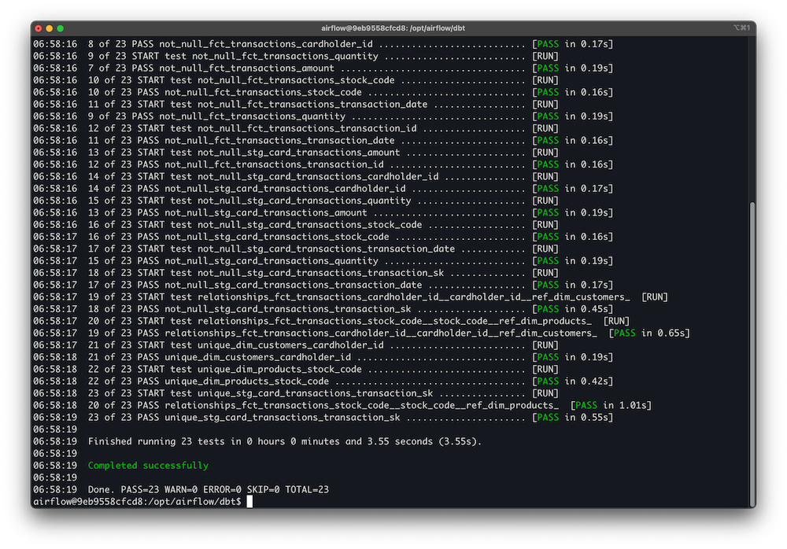
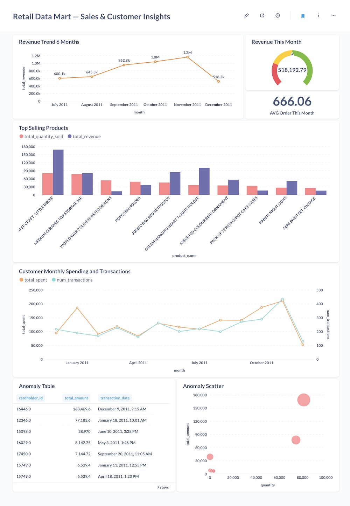
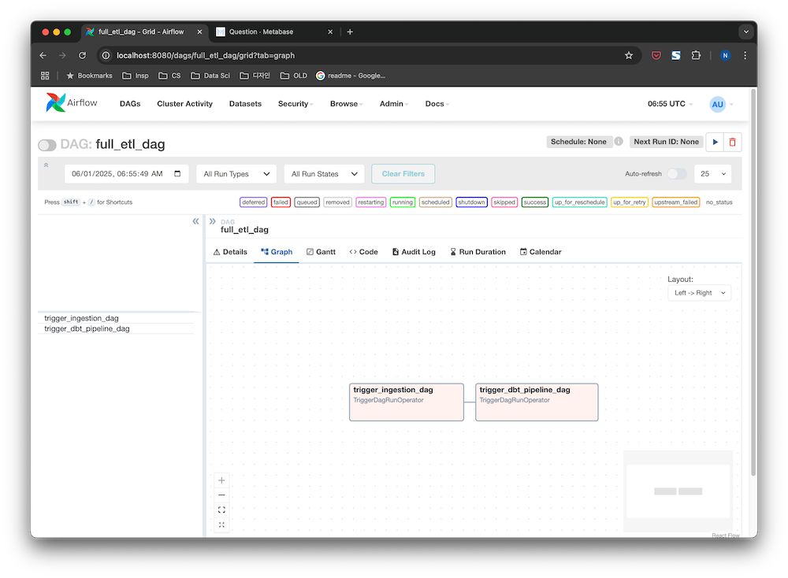
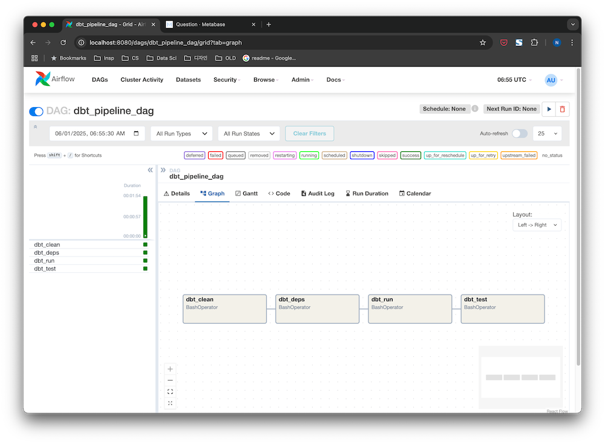
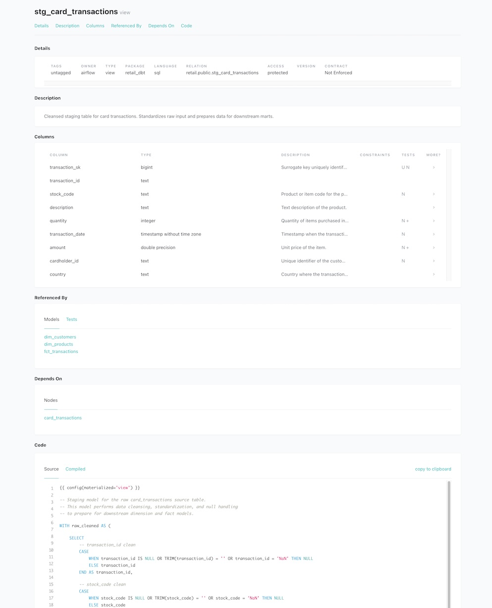
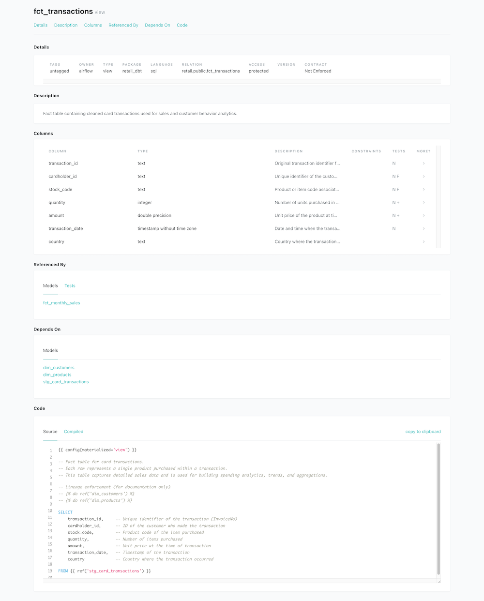
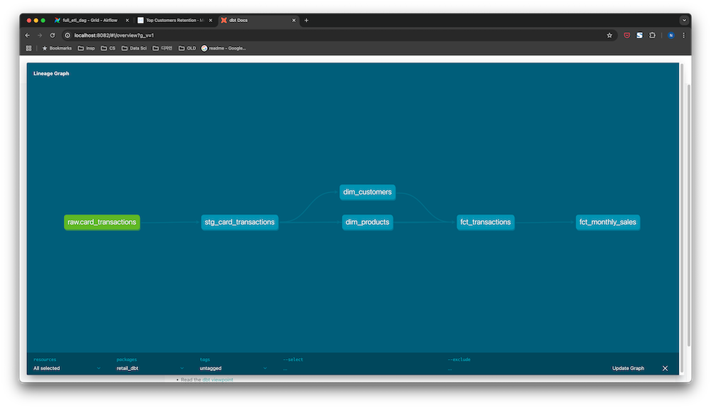

[🇺🇸 English](./README.md) | [🇰🇷 한국어](./README.ko.md)

# 리테일 데이터 마트 — 풀스택 데이터 엔지니어링 프로젝트

이 프로젝트는 실제 운영 환경의 엔드 투 엔드 데이터 엔지니어링 파이프라인을 구현합니다. 실제 리테일 거래 데이터를 활용하여 배치 분석 및 대시보드용 데이터 마트를 구축했으며, 실용적이고 운영 수준의 데이터 워크플로우에 중점을 두었습니다.

## 🚀 핵심 기술 스택

- **오케스트레이션**: Apache Airflow (Docker화)
- **데이터 변환**: dbt (Data Build Tool)
- **데이터 저장소**: PostgreSQL (OLAP 스타일 데이터 마트)
- **대시보드 & BI**: Metabase
- **컨테이너화**: Docker Compose
- **클라우드 준비**: S3 연동 가능한 데이터 수집 로직 (향후 확장성)
- **데이터 품질**: dbt 테스트 (허용 범위, 고유성, 참조 무결성)

## 🔧 아키텍처 개요

- **데이터 소스**: 실제 리테일 거래 데이터 (UCI Online Retail Dataset)
- **ETL 파이프라인**: 
  - 원본 데이터 로드 → PostgreSQL
  - dbt 스테이징 모델을 통한 데이터 정제 및 준비
  - 팩트/디멘션 테이블 구축
  - 월별 매출 집계 생성
  - 포괄적인 데이터 품질 검증 수행

- **오케스트레이션**:  
  - 분리된 DAG: `ingestion_dag`, `dbt_pipeline_dag`, `full_etl_dag`  
  - 확장 가능한 모듈식 설계

## 📊 데이터 마트 모델

- `stg_card_transactions`: 데이터 정제 및 표준화를 포함한 스테이징 모델
- `dim_customers`, `dim_products`: 디멘션 모델
- `fct_transactions`: 완전한 거래 수준 세분화를 갖춘 핵심 팩트 모델
- `fct_monthly_sales`: BI 및 리포팅을 위한 월별 집계 팩트 테이블

## ✅ 데이터 품질 관리

운영 수준의 데이터 무결성을 보장하는 dbt 테스트 구현:

- **Not Null 테스트** - 모든 중요 필드
- **허용 범위 테스트** - 수량 및 금액
- **고유 키 테스트** - 대리 키 (transaction_sk)
- **관계 테스트** - 팩트/디멘션 테이블 간 참조 무결성



## 🖥️ 대시보드 

> 분석 사용자를 위한 완전 자동화된 Metabase 대시보드 구축

### 대시보드 예시:
- **6개월 매출 트렌드**
- **이달 매출**
- **이달 평균 주문 금액**
- **베스트셀러 제품**
- **고객 지출 트렌드**
- **이상 탐지 (대량 주문 / 의심 거래)**



## ⚙️ Airflow 파이프라인 




- 모듈식 Airflow DAG
- 분리된 데이터 수집 및 dbt 변환 파이프라인
- 일일 배치 실행을 위한 쉬운 확장

## 📦 dbt 문서화 

<p align="center">
  
  
</p>

- 완전한 메타데이터 관리
- dbt 모델 문서화
- 컬럼 수준 설명
- 시각적 계보 그래프



## 🔑 활용 기술

- 종단간 데이터 파이프라인 아키텍처
- dbt 모델링 및 데이터 마트 설계
- Docker 기반 오케스트레이션 (Airflow, Metabase, Postgres)
- dbt 테스트를 통한 데이터 품질 관리
- 대시보드 구축 및 KPI 리포팅 (Metabase)
- 운영 수준의 엔지니어링 사고 (모듈식, 확장 가능, 장애 내성)

## 🎯 프로젝트의 의미

> 이 프로젝트는 운영 데이터 플랫폼에서 기대할 수 있는 실제 배치 처리 파이프라인을 시뮬레이션하며 아래와 같은 기술을 보여주고자 하였습니다. 

- **데이터 수집부터 리포팅까지** 파이프라인을 구축하는 능력
- **데이터 검증 및 관찰 가능성**에 대한 이해
- **dbt + Airflow + Docker + BI 스택** 등 최신 도구를 활용하는 능력

## 📝 배포 및 사용법

이 저장소는 다음 명령어로 배포할 수 있습니다:

```bash
docker compose up --build
```

---
Made with 🧡 by Nami Kim
[Blog](https://namixkim.com) | [GitHub](https://github.com/namikimlab) | [LinkedIn](https://linkedin.com/in/namixkim)