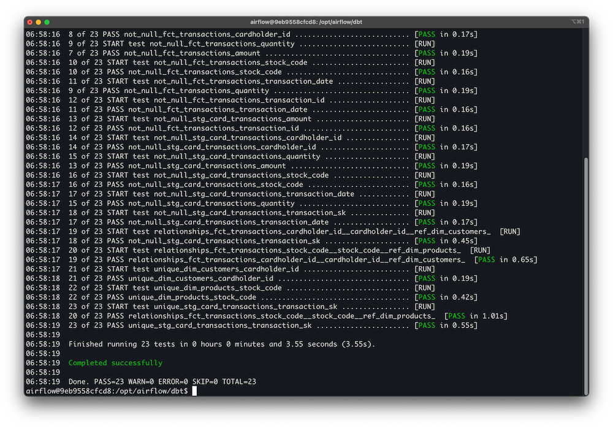
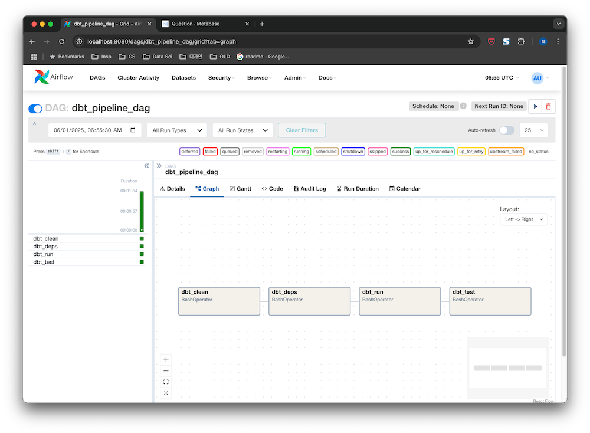

[🇺🇸 English](./README.md) | [🇰🇷 한국어](./README.ko.md)

# Retail Data Mart — Full-stack Data Engineering Project

This project demonstrates a real-world end-to-end data engineering pipeline. Using actual retail transaction data, I built a data mart for batch analytics and dashboarding, focusing on practical, production-ready data workflows.


## 🚀 Key Tech Stack

- **Orchestration**: Apache Airflow (Dockerized)
- **Data Transformation**: dbt (Data Build Tool)
- **Data Storage**: PostgreSQL (OLAP-style data mart)
- **Dashboard & BI**: Metabase
- **Containerization**: Docker Compose
- **Cloud Readiness**: S3-ready ingestion logic (future extensibility)
- **Data Quality**: dbt tests (accepted range, uniqueness, referential integrity)


## 🔧 Architecture Overview

- **Data Source**: Raw retail transaction data (UCI Online Retail Dataset)
- **ETL Pipeline**: 
  - Load raw data → PostgreSQL
  - Cleanse and stage data with dbt staging models
  - Build fact/dimension tables
  - Generate monthly sales aggregations
  - Perform extensive data quality validations

- **Orchestration**:  
  - Separated DAGs: `ingestion_dag`, `dbt_pipeline_dag`, `full_etl_dag`  
  - Modular design for extensibility


## 📊 Data Mart Models

- `stg_card_transactions`: Staging model with data cleansing and standardization
- `dim_customers`, `dim_products`: Dimension models
- `fct_transactions`: Core fact model with full transaction-level granularity
- `fct_monthly_sales`: Monthly aggregation fact table for BI & reporting


## ✅ Data Quality Controls

Implemented dbt tests to ensure production-grade data integrity:

- **Not Null Tests** for all critical fields
- **Accepted Range Tests** for quantity and amount
- **Unique Key Tests** for surrogate keys (transaction_sk)
- **Relationship Tests** for referential integrity across fact/dimension tables



## 🖥️ Dashboard Showcase

> Built fully automated dashboards on Metabase for analytics consumers.

### Example Dashboards:
- **Revenue Trend 6 Months**
- **Revenue This Month**
- **Average Order Value This Month**
- **Top Selling Products**
- **Customer Spending Trend**
- **Anomaly Detection (Large Orders / Suspicious Transactions)**


## ⚙️ Airflow Pipeline



- Modular Airflow DAGs
- Separate ingestion & dbt transformation pipeline
- Easy to extend for daily batch runs


## 📦 dbt Documentation 
<p align="center">
  
  
</p>

- Full metadata management
- dbt model documentation
- Column-level descriptions
- Visual lineage graphs


## 🔑 Skills Demonstrated

- End-to-end data pipeline architecture
- dbt modeling and data mart design
- Docker-based orchestration (Airflow, Metabase, Postgres)
- Data quality management with dbt tests
- Dashboard building and KPI reporting (Metabase)
- Production-level engineering mindsets (modular, extensible, fault-tolerant)


## 🎯 Why this matters

> This project simulates real-world batch processing pipelines you'd expect in a production data platform. 

It demonstrates:
- my ability to build pipelines **from ingestion to reporting**
- my understanding of **data validation and observability**
- my ability to work with modern tools in **dbt + Airflow + Docker + BI stack**

## 📝 Deployment & Usage

This repo can be deployed via:

```bash
docker compose up --build
```
---
Made with 🧡 by Nami Kim
[Blog](https://namixkim.com) | [GitHub](https://github.com/namikimlab) | [LinkedIn](https://linkedin.com/in/namixkim)